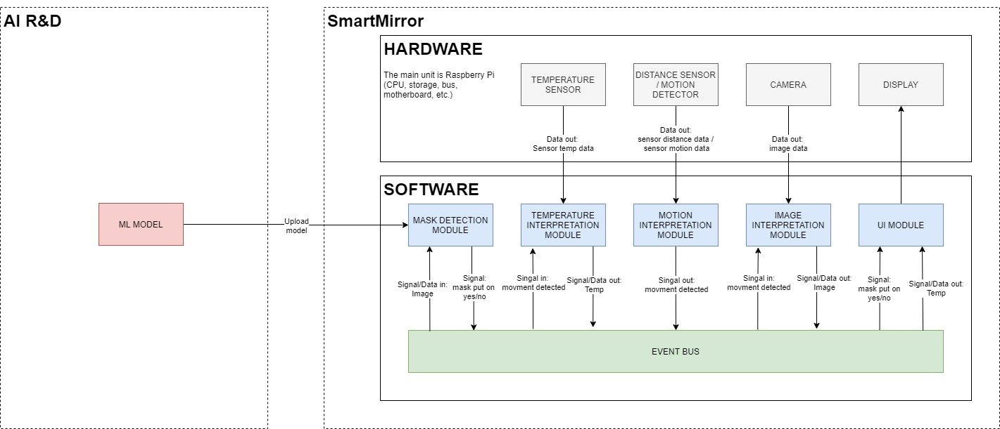

# ai-smart-mirror
Repository contains all the code necessary to run working solution for smart mirror.

# Architecture


# Run
## on raspberry PI
```bash
## install some requirements
### docker
curl -fsSL https://get.docker.com -o get-docker.sh
sudo sh get-docker.sh
sudo usermod -aG docker ${USER}
### docker-compose
sudo pip3 install docker-compose
### password keyring
sudo apt install gnupg2 pass

## get login command using aws cli
aws ecr get-login

## !! Remove from output of previous command "-e none" and paste result into terminal, will log you into ECR
## should looks like this:
## docker login -u AWS -p ... https://573518775438.dkr.ecr.us-east-2.amazonaws.com

## turn docker compose suite up
docker-compose pull
docker-compose up

## images by default are saved into /tmp/images
```

# Modules
## Camera module
WIP
## Distance sensor module
WIP

# Test environment
Configuration and usage of test environment can be found in [test environment documentation](doc/test_environment.md).
